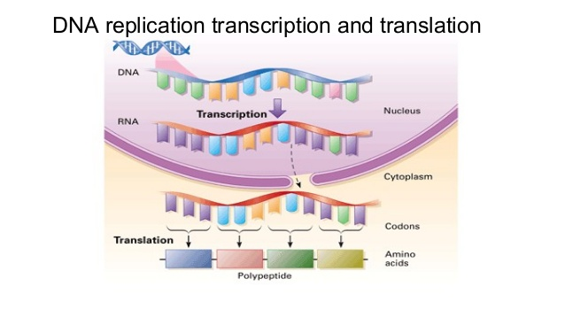

---
title: Genetic manipulations
author: 
- Arthur JUNG 
- Maxime MICHELAT
- Mickaël BAUR
...

\pagebreak

#Introduction
##The subject

We decided to talk about genetic manipulations because it is an interesting subject and there are a lot of research going on.
Also, the promises of this field are quite interesting but they raise some issues.
We decided that we should work on one or more subjects, such as:

  - Transhumanism
  - Cures
  - Eradication of invasive species
  - GMOs
  - Hybrids
  - And all the problems that come along with all that

##A short history of
###How DNA works

###Genetic manipulations

Blablabla.
Gene manipulation started as early as ... B.C.. 
The first men understood that some traits were passed from parents to children.
This knowledge was used by ancient civilizations through interspecies breeding to create new crop strains to make them more edible, or increase the productivity.

Indeed, science grew a lot since then, and ever since the start of molecular genetics, this field amazed by the many applications in the real world and the problems they could solve, and even though such applications failed to come to use quickly, we are still getting closer and closer to the day we can genetically engineer human beings.

Quite recently, the discovery by Emmanuelle Charpentier and Jennifer Doudna of CRISPR[^crispr]/Cas9, a relatively easy-to-use and cheap tool for editing DNA should allow for easier and more efficient research.

[^crispr]: [https://en.wikipedia.org/wiki/CRISPR](https://en.wikipedia.org/wiki/CRISPR)

###DNA sequencing

In the meantime, DNA sequencing achieved a significant victory in 2000 after the sequencing of an entire human genome.[^hugenproject]
Initially costing several million dollars this technique is now making its way to modern medicine as it is getting more and more efficient and cheaper.
This helped biologists discover the mutations that cause some diseases, such as the CTFR[^CTFR] gene mutation causing cystic fibrosis[^cf], a rare genetic disorder affecting mostly lungs, or haemoglobic gene mutations that can cause disease such as the sickle-cell disease[^scd].

[^hugenproject]: [The Human Genome Project](https://en.wikipedia.org/wiki/Human\_Genome\_Project)
[^CTFR]: Cystic Fibrosis Transmembrane Conductance Regulator
[^cf]: [https://en.wikipedia.org/wiki/Cystic\_fibrosis](https://en.wikipedia.org/wiki/Cystic\_fibrosis)
[^scd]: [https://en.wikipedia.org/wiki/Sickle-cell\_disease](https://en.wikipedia.org/wiki/Sickle-cell\_disease)

##The techniques

Many techniques have been used during the past to alter DNA, such as zinc finger nuclease and TALENs, but the most promising one, CRISPR/Cas9 saw the light quite recently, in 2012.
It is so promising, in fact, that it has been the American Association for the Advancement of Science's choice for breakthrough in the year 2015.
It makes things so much more easier than before, that by 2014, many studies have been carried out, using CRISPR/Cas9, in different fields, from biofuel engineering, to genetically modified crop strains.

But although this technology is showing some interesting results, experts say that it is not yet fit for human genome editing and probably won't be for the next decade.
Still, CRISPR raises interesting questions, especially since it is so easy to use, compared to other technologies, that undergraduate students can use it.
More than ever, bioethics debates should take place, in order to prevent misuse of genetic editing tools.

\pagebreak

#The promises of genome editing ...
##Preventing epidemics

For 20 years, the James Lab (University of California) tried to create malaria-resistant mosquitoes, with a success rate of about 50%.
In 2015, 2 San Diego scientists, Ethan Bier and Valentino Gantz announced a new method for generating mutations on both copies of a gene in fruit flies.
The mutations were then passed on to 95% of the flies' offspring.
Combining the two techniques, a collaboration of both teams succeeded in creating malaria-resistant mosquitoes that pass on this ability to 99.5% of said mosquitoes' offspring.

See the article : [https://news.uci.edu/research/university-of-california-scientists-create-malaria-blocking-mosquitoes/](https://news.uci.edu/research/university-of-california-scientists-create-malaria-blocking-mosquitoes/).

With more than 200 million people infected, according the World Health Organization, this technique, if used outside a laboratory could relieve the pain of poor countries with little to no medical supplies, especially on the african continent.
And this technique doesn't only apply to mosquitoes, it could be used to eliminate other disease vectors like yellow fever.

##Curing diseases

In october 2016, physicians from UC Berkeley published a paper in *Science* in which they claim to have found a preliminary technique involving gene editing in stem cells in order to cure sickle cell disease.

[Voir ce truc](http://www.latimes.com/science/sciencenow/la-sci-sn-crispr-sickle-cell-20161012-snap-story.html#)
[Sickle cell cure](http://news.berkeley.edu/2016/10/12/genome-engineering-paves-way-for-sickle-cell-cure/)

##Improving mankind

[Au pif](http://www.nature.com/news/chinese-scientists-genetically-modify-human-embryos-1.17378)

\pagebreak

#\... and the complications they raise
##Ethical questions

[Science based medicine](https://sciencebasedmedicine.org/crispr-and-the-ethics-of-gene-editing/)

##The medical issues

##The legislation in the European Union
###GMOs
As of now, the European Union law regarding Genetically Modified Organisms aims to ensure tracability, clear labelling and to protect the environement, as well as human and animal health.
As such, genetically modified food has been authorized for agriculture use, as long as its origin, composition and properties are accurately labelled, in order for livestock farmers, for example to be able to make an informed decision when buying genetically modified food.[^gmolaw]

By comparison, the vast majority of food in the United States comes from genetically modified animals, and the US law doesn't force them to put a label on products that indicates they come from genetically engineered sources.[^tedprw]

[^tedprw]:[https://www.ted.com/talks/paul\_root\_wolpe\_it\_s\_time\_to\_question\_bio\_engineering](https://www.ted.com/talks/paul\_root\_wolpe\_it\_s\_time\_to\_question\_bio\_engineering)
[^gmolaw]:[http://eur-lex.europa.eu/legal-content/EN/TXT/HTML/?uri=CELEX:32003R1829&from=EN](http://eur-lex.europa.eu/legal-content/EN/TXT/HTML/?uri=CELEX:32003R1829&from=EN)

###Research

The EU allows genetic research and manipulations as long as the *scientific validity* and the *clinical validity* criteria are met.

